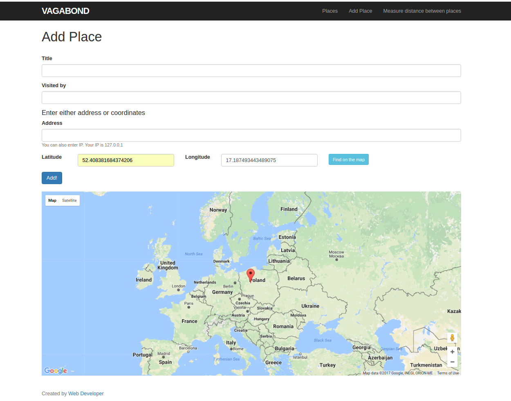

# Vagaband

This Project is Vagaband web app using Geocoder gem in Rails 5.

  

## Install

Install Ruby -v 2.4.1 and Rails -v 5.0.1

bundle install

rake db:create db:migrate db:schema:load

rails server